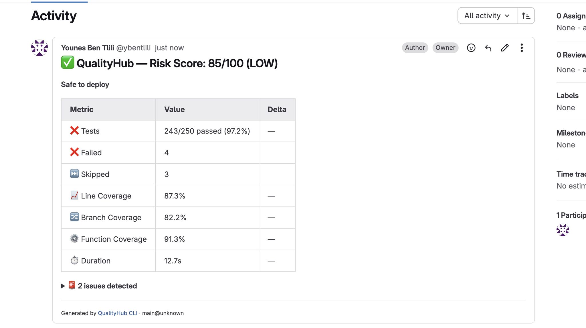

# 🔍 QualityHub CLI

[](https://www.npmjs.com/package/qualityhub-cli)
[](LICENSE)
[](https://nodejs.org/)

**Know if your release is safe to deploy — in 2 seconds.**

QualityHub CLI parses your test results, analyzes quality trends, detects regressions, and gives you a clear risk score with a go/no-go decision. Works locally, in CI/CD, and posts automatic quality reports directly on your GitLab MRs and GitHub PRs.

<!-- TODO: replace with your actual GIF -->


---

## ⚡ Quick Start

```bash
# Install
npm install -g qualityhub-cli

# Run your tests, then:
qualityhub parse jest ./coverage
qualityhub analyze
```

That's it. No account, no config, no server needed.

---

## 🎯 What You Get

```
🔍 QualityHub Analysis
━━━━━━━━━━━━━━━━━━━━━━━━━━━━━━━━━━━━━━━━━━━━━━━━━━
   Project:  my-app@2.3.1
   Branch:   main
   Commit:   a3f4d2c

   📊 Tests
      ❌ 243/250 passed (97.2%)
      ❌ 4 failed
      ⏭️  3 skipped
      ⏱️  Duration: 12.7s

   📈 Coverage
      Lines:      █████████████████░░░ 87.3%  ▼ -3.2%
      Branches:   ████████████████░░░░ 82.2%
      Functions:  ██████████████████░░ 91.3%

   🚨 Issues Detected
      🟡 4 tests failed (97.2% pass rate)
      🎲 2 flaky tests detected
      📉 Coverage dropped 3.2% since last run
      🆕 2 new test failures since last run

━━━━━━━━━━━━━━━━━━━━━━━━━━━━━━━━━━━━━━━━━━━━━━━━━━
   🎯 Risk Score:  ⚠️ 72/100 (MEDIUM RISK)
   📋 Decision:    ⚠️  CAUTION — Review issues before deploying
━━━━━━━━━━━━━━━━━━━━━━━━━━━━━━━━━━━━━━━━━━━━━━━━━━
```

And automatically posted on your MR:

<!-- TODO: add your screenshot here -->


---

## ✨ Features

- **🔍 Instant analysis** — Risk score + go/no-go decision in seconds
- **💬 Auto MR/PR comments** — Posts quality reports directly on GitLab MRs and GitHub PRs
- **📉 Regression detection** — Automatically compares with previous runs
- **🎲 Flaky test detection** — Identifies slow/unreliable tests
- **📊 Coverage tracking** — Lines, branches, functions with trend deltas
- **📝 Markdown reports** — Clean formatted output for any CI system
- **🔌 Multi-framework** — Jest, JUnit, JaCoCo out of the box
- **⚡ Zero config** — Works instantly, no server required

---

## 📖 Usage

### 1. Parse your test results

```bash
# JavaScript / TypeScript (Jest)
qualityhub parse jest ./coverage

# Java / Kotlin (JaCoCo + JUnit)
qualityhub parse jacoco ./target/site/jacoco/jacoco.xml
qualityhub parse junit ./target/surefire-reports

# With project metadata
qualityhub parse jest ./coverage \
  --project my-app \
  --version 2.3.1 \
  --commit a3f4d2c \
  --branch main
```

### 2. Analyze

```bash
# Terminal output (default)
qualityhub analyze

# Markdown output
qualityhub analyze --format markdown

# Save markdown to file
qualityhub analyze --format markdown --output report.md
```

### 3. Post comment on GitLab MR / GitHub PR

```bash
# GitLab (auto-detects MR in CI)
qualityhub analyze --comment

# GitLab with explicit options
qualityhub analyze --comment \
  --provider gitlab \
  --token $GITLAB_TOKEN \
  --project-id 123 \
  --mr-id 42

# GitHub
qualityhub analyze --comment \
  --provider github \
  --token $GITHUB_TOKEN \
  --project-id owner/repo \
  --mr-id 42

# Self-hosted GitLab
qualityhub analyze --comment \
  --api-url https://gitlab.yourcompany.com \
  --token $GITLAB_TOKEN
```

In CI/CD, `--token`, `--project-id`, and `--mr-id` are **auto-detected** from environment variables (`CI_PROJECT_ID`, `CI_MERGE_REQUEST_IID`, `GITLAB_TOKEN` for GitLab; `GITHUB_TOKEN`, `GITHUB_REPOSITORY`, `PR_NUMBER` for GitHub).

### 4. Push to QualityHub (optional)

```bash
qualityhub push qa-result.json
```

---

## 🔄 CI/CD Integration

### GitLab CI — with automatic MR comments

```yaml
quality-check:
  stage: test
  script:
    - npm test -- --coverage
    - npx qualityhub-cli parse jest ./coverage
    - npx qualityhub-cli analyze --comment
  cache:
    paths:
      - .qualityhub/   # Persist history between runs
  artifacts:
    when: always
    paths:
      - qa-result.json
  only:
    - merge_requests
```

> Set `GITLAB_TOKEN` as a CI/CD variable (needs `api` scope). The CLI auto-detects the MR and project ID from GitLab's environment variables.

### GitHub Actions — with automatic PR comments

```yaml
- name: Run tests
  run: npm test -- --coverage

- name: Quality Check
  run: |
    npx qualityhub-cli parse jest ./coverage
    npx qualityhub-cli analyze --comment
  env:
    GITHUB_TOKEN: ${{ secrets.GITHUB_TOKEN }}

- name: Cache QualityHub history
  uses: actions/cache@v3
  with:
    path: .qualityhub
    key: qualityhub-${{ github.ref }}
```

> `GITHUB_TOKEN` is automatically available in GitHub Actions — no setup needed.

The CLI exits with code 1 when the decision is **BLOCK**, so your pipeline fails automatically on critical quality issues.

---

## 📝 Auto MR/PR Comments

When you run `qualityhub analyze --comment`, the CLI posts a formatted quality report directly on your merge request:

| Metric | Value | Delta |
|--------|-------|-------|
| ❌ Tests | 243/250 passed (97.2%) | — |
| 📈 Line Coverage | 87.3% | ▼ -3.2% |
| 🔀 Branch Coverage | 82.2% | — |
| ⚙️ Function Coverage | 91.3% | — |
| ⏱️ Duration | 12.7s | +15% |

> ⚠️ **CAUTION** — Risk Score: 72/100 · Review issues before deploying

The comment is **automatically updated** on each pipeline run — no duplicate comments cluttering your MR.

---

## 📉 Automatic Regression Detection

QualityHub stores run history locally in `.qualityhub/history.json`. On every run, it compares with the previous analysis and detects:

- **Coverage drops** — "Coverage decreased 3.2% since last run"
- **New test failures** — "2 new test failures since last run"
- **Build slowdowns** — "Build time increased 18%"
- **Removed tests** — "12 tests removed since last run"

No server needed. History persists across runs.

---

## 🎨 Supported Frameworks

| Framework | Language | Coverage | Tests |
|-----------|----------|----------|-------|
| **Jest** | JavaScript / TypeScript | ✅ | ✅ |
| **JaCoCo** | Java / Kotlin | ✅ | — |
| **JUnit** | Java / Kotlin / Python | — | ✅ |

More coming soon: pytest, XCTest, Go test, Rust.

---

## 📄 qa-result.json Format

QualityHub uses an open standard format for quality metrics:

```json
{
  "version": "1.0.0",
  "project": {
    "name": "my-app",
    "version": "2.3.1",
    "commit": "a3f4d2c",
    "branch": "main",
    "timestamp": "2026-02-17T20:00:00Z"
  },
  "quality": {
    "tests": {
      "total": 250,
      "passed": 243,
      "failed": 4,
      "skipped": 3,
      "duration_ms": 12700,
      "flaky_tests": ["Metrics API > should handle concurrent uploads"]
    },
    "coverage": {
      "lines": 87.3,
      "branches": 82.2,
      "functions": 91.3,
      "statements": 88.7
    }
  }
}
```

Any tool that outputs this format works with QualityHub. [Create your own adapter →](docs/creating-adapter.md)

---

## 🔧 All Commands

| Command | Description |
|---------|-------------|
| `qualityhub init` | Initialize QualityHub in current directory |
| `qualityhub parse <format> <path>` | Parse test results → `qa-result.json` |
| `qualityhub analyze` | Analyze and show risk assessment |
| `qualityhub analyze --format markdown` | Output as Markdown |
| `qualityhub analyze --format markdown -o report.md` | Save Markdown to file |
| `qualityhub analyze --comment` | Post analysis as comment on GitLab MR / GitHub PR |
| `qualityhub analyze --comment --provider github` | Post on GitHub PR |
| `qualityhub push <file>` | Push results to QualityHub server |

### `analyze --comment` options

| Option | Description | Default |
|--------|-------------|---------|
| `--comment` | Enable MR/PR commenting | — |
| `--provider <type>` | `gitlab` or `github` | `gitlab` |
| `--token <token>` | API token (or `GITLAB_TOKEN` / `GITHUB_TOKEN` env var) | — |
| `--project-id <id>` | GitLab project ID or GitHub `owner/repo` | auto-detected in CI |
| `--mr-id <id>` | MR / PR number | auto-detected in CI |
| `--api-url <url>` | Custom API URL (self-hosted GitLab) | — |

---

## 🧪 Try It Now

```bash
# Clone and test with example data
git clone https://github.com/ybentlili/qualityhub-cli
cd qualityhub-cli
npm install && npm run build && npm link

# Parse example Jest results
qualityhub parse jest ./examples/jest

# See the analysis
qualityhub analyze

# See it as Markdown
qualityhub analyze --format markdown
```

---

## 🗺️ Roadmap

- [x] Parse Jest, JaCoCo, JUnit
- [x] Risk score + go/no-go decision
- [x] Local history + regression detection
- [x] Markdown reports for MR/PR
- [x] Auto-comment on GitLab MR / GitHub PR ← **New in v1.2.0**
- [ ] Auto-detect git context (project, branch, commit)
- [ ] Configurable thresholds (`.qualityhub.yaml`)
- [ ] pytest adapter
- [ ] GitHub Action on Marketplace
- [ ] AI-powered risk analysis (coming soon)

---

## 🔗 Links

- **GitHub**: [ybentlili/qualityhub-cli](https://github.com/ybentlili/qualityhub-cli)
- **npm**: [qualityhub-cli](https://www.npmjs.com/package/qualityhub-cli)
- **Main project**: [ybentlili/qualityhub](https://github.com/ybentlili/qualityhub)

---

## 📝 License

MIT — see [LICENSE](LICENSE)

---

## 🤝 Contributing

Contributions welcome! The easiest way to help:

- **Add an adapter** — pytest, XCTest, Go test, Rust
- **Report bugs** — [Open an issue](https://github.com/ybentlili/qualityhub-cli/issues)
- **Star the repo** — It helps visibility ⭐

See [CONTRIBUTING.md](CONTRIBUTING.md) for details.